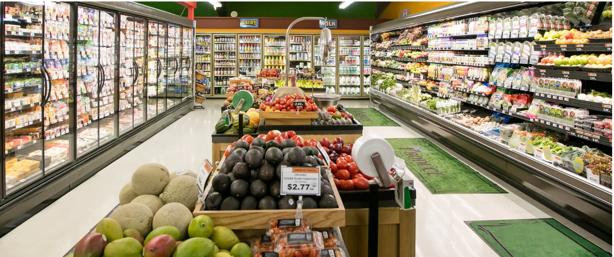
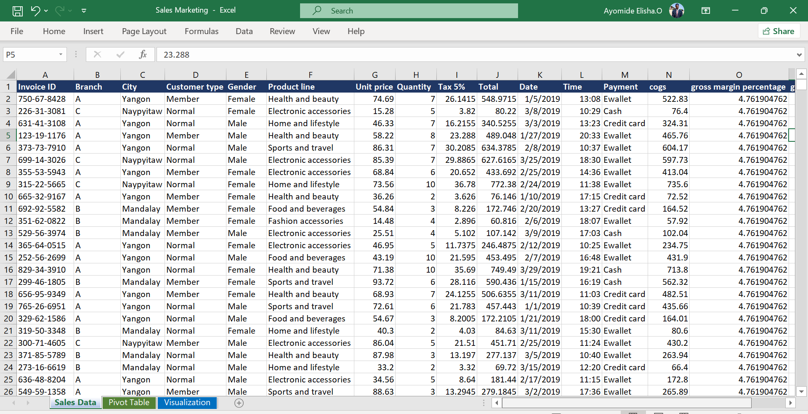
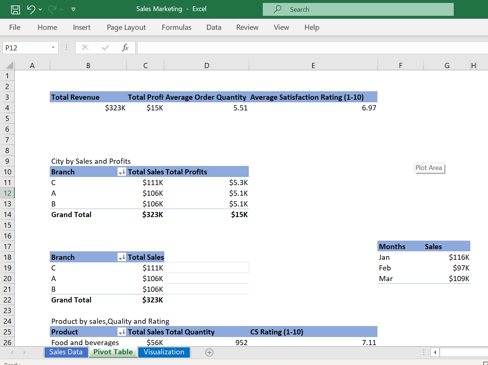
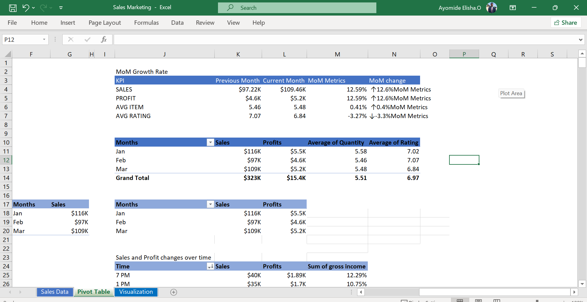
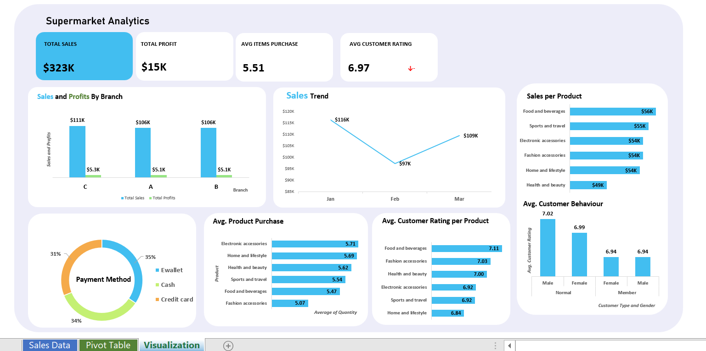

# Grocery stores Analysis

---

## Introduction  
This is a Microsoft Excel project on sales analysis of an imaginary store called **Grocery stores**.

The project is to analyze and derive insights to answer crucial questions and help the store make data driven decisions.

*_Disclaimer_*: _ALL datasets and reports do not represent any company, institution or country, but just a dummy dataset to demonstrate capabilities of SQL, Excel and Visualization_.

## Problem statement
1.) Which branch or city generates the highest sales and profit?

2.) How do sales and profit change over time, and what is the MoM growth rate?

3.) Which product lines contribute most to sales, quantity sold, and ratings?

4.) How do customer type (Member vs Normal) and gender impact sales performance?

5.) Which payment method is most commonly used, and which generates the highest revenue?

## Skills / concept demonstrated
The following are the Microsoft Excel and Analytics features incorperated : 
- Data Cleaning
- Data Transformation
- Pivot Tables
- Pivot Charts
- Interactive Dashboard

## Tables
This is the table after performing extensive data cleaning, transformation, and structure optimization to prepare the data for deeper business analysis.

Grocery stores data
:---------------------------

## Pivot Model
This shows the following Pivot models used in this analytics
  Key KPIs at a Glance      |  Month over Month Growth Rate 
:--------------------------:|:--------------------------------:
    |   

## Visualization
This dashboard allows decision-makers to quickly spot opportunities, track performance, and improve customer experience.

## Recommendation
- Replicate Branch C’s layout, promotions, or product strategy across A & B.
- Launch mid-quarter promotions to stabilize sales dips.
- Improve sourcing or reposition pricing in Home & Lifestyle.
- Partner with E-wallet providers for discounts or loyalty points. 

